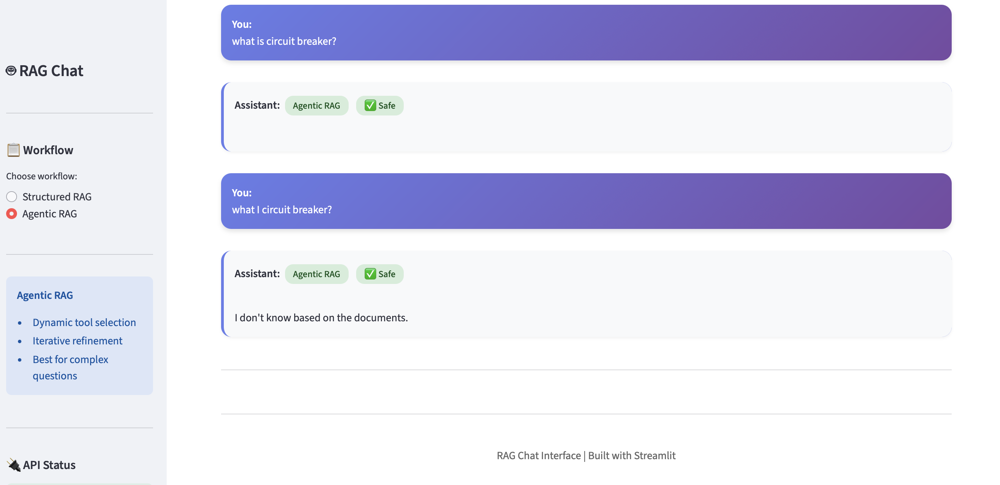

# RAG API - Document Chat System

A production-ready RAG (Retrieval Augmented Generation) API built with FastAPI, LangGraph, and ChromaDB. Features query decomposition, multi-query retrieval, LLM reranking, and comprehensive evaluation frameworks.

## 🎯 Two Versions Available

1. **Structured RAG** (This directory) - Fixed pipeline, predictable, fast
2. **Agentic RAG** (`agentic/` directory) - Dynamic flow, LLM-based decisions, iterative refinement

See `agentic/README.md` for the agentic version with LLM-based tool selection and conditional routing.

## 🚀 Features

- **Query Decomposition**: Breaks complex queries into 2-4 optimized sub-queries
- **Multi-Query Retrieval**: Retrieves documents from multiple query perspectives
- **LLM Reranking**: Parallel async scoring for precise document relevance
- **Conversation Memory**: Session-based conversation history
- **Input/Output Guardrails**: Safety checks at both input and output stages
- **LangSmith Integration**: Full observability and tracing
- **Evaluation Frameworks**: LangSmith and RAGAS evaluation support

## 📋 Prerequisites

- Python 3.13+
- OpenAI API Key
- (Optional) LangSmith API Key for observability

## 🛠️ Installation

### 1. Clone the Repository

```bash
git clone <repository-url>
cd api
```

### 2. Create Virtual Environment

```bash
python -m venv venv
source venv/bin/activate  # On Windows: venv\Scripts\activate
```

### 3. Install Dependencies

```bash
pip install -r requirements.txt
```

### 4. Set Up Environment Variables

Create a `.env` file in the root directory:

```bash
# Required
OPENAI_API_KEY=your-openai-api-key

# Optional (for LangSmith observability)
LANGSMITH_API_KEY=your-langsmith-api-key
LANGSMITH_TRACING=true
LANGSMITH_PROJECT=rag-api
```

## 🏃 Running the Application

### Start the FastAPI Server

```bash
uvicorn app.main:app --reload
```

The API will be available at:
- **API**: http://localhost:8000
- **Swagger UI**: http://localhost:8000/docs
- **ReDoc**: http://localhost:8000/redoc

## 🧰 MCP (Model Context Protocol) Tooling (Cursor / Claude Desktop)

This repo includes an **MCP server** that exposes this FastAPI backend as tools for MCP-capable clients (e.g., Cursor, Claude Desktop).

### Prereqs

1. Start the backend (single API):

```bash
cd /Users/sachin/nltk_data/api
./start_local_dev.sh
```

2. Run MCP server (stdio):

```bash
cd /Users/sachin/nltk_data/api
source venv/bin/activate
python scripts/mcp_server.py
```

The MCP server forwards calls to the backend using:
- `MCP_API_BASE_URL` (default: `http://127.0.0.1:8000`)

### Cursor (JSON config)

Create this file:
- `/Users/sachin/nltk_data/api/.cursor/mcp.json`

```json
{
  "mcpServers": {
    "agentic-document-chat": {
      "command": "python",
      "args": ["/Users/sachin/nltk_data/api/scripts/mcp_server.py"],
      "env": {
        "MCP_API_BASE_URL": "http://127.0.0.1:8000"
      }
    }
  }
}
```

### Claude Desktop (JSON config)

macOS:
- `~/Library/Application Support/Claude/claude_desktop_config.json`

```json
{
  "mcpServers": {
    "agentic-document-chat": {
      "command": "python",
      "args": ["/Users/sachin/nltk_data/api/scripts/mcp_server.py"],
      "env": {
        "MCP_API_BASE_URL": "http://127.0.0.1:8000"
      }
    }
  }
}
```

### What tools are exposed

The MCP server exposes these tools (and proxies them to the FastAPI endpoints):
- `chat` → `POST /agent/chat`, `POST /agentic/chat`, `POST /multiagent/chat` (via `workflow`)
- `ingest_texts` → `POST /agent/ingest/json`
- `status` → `GET /agent/debug/status`
- `feedback` → `POST /agent/feedback`

## 🎨 Web UI (Streamlit)

A simple, elegant, and intuitive web interface for both Structured and Agentic RAG workflows.



### Quick Start

1. **Install UI dependencies:**
   ```bash
   pip install streamlit requests
   ```

2. **Start backend server:**
   ```bash
   uvicorn app.main:app --reload --port 8000
   ```

3. **Launch the UI:**
   ```bash
   # Terminal 3 - UI
   streamlit run ui.py
   # Or use the startup script:
   ./start_ui.sh
   ```

The UI will open at `http://localhost:8501`

### Features

- ✨ **Workflow Selection**: Switch between Structured and Agentic RAG
- 💬 **Chat Interface**: Clean, modern chat UI with conversation history
- 🔒 **Safety Indicators**: Visual guardrail status (Safe/Blocked/Filtered)
- 📊 **API Status**: Real-time connection monitoring
- 🔄 **Session Management**: New session, clear chat, persistent context

See `UI_README.md` for detailed documentation.

## 📚 Setup Files and Scripts

### 1. Ingest Golden Dataset

Ingest 20 sample documents for testing:

```bash
# Make sure server is running first
./ingest_golden_dataset.sh
```

Or manually via curl:

```bash
curl -X POST "http://localhost:8000/agent/ingest/json" \
  -H "Content-Type: application/json" \
  -d '{
    "texts": ["Your document text here..."],
    "metadatas": [{"topic": "example"}]
  }'
```

### 2. Run Evaluation

#### LangSmith Evaluation (Cloud-based)

```bash
# Test LangSmith evaluation
python test_eval_langsmith.py

# Full LangSmith evaluation
python langsmith_eval.py
```

**Requirements**: 
- `LANGSMITH_API_KEY` in `.env`
- Documents ingested first

**Results**: View at https://smith.langchain.com

#### RAGAS Evaluation (Local)

```bash
# Install RAGAS if not already installed
pip install ragas datasets

# Test RAGAS evaluation
python test_eval_ragas.py

# Full RAGAS evaluation
python eval_ragas.py
```

**Results**: Saved to `ragas_eval_results.csv`

#### Simple Evaluation (Custom Metrics)

```bash
python eval_setup.py
```

**Results**: Saved to `eval_results.json`

### 3. Run Tests

```bash
# Run all tests
pytest

# Run with coverage
pytest --cov=app --cov-report=html

# Run specific test file
pytest tests/test_agents.py
```

## 🔌 API Endpoints

### Document Ingestion

#### POST `/agent/ingest/json`
Ingest documents via JSON:

```bash
curl -X POST "http://localhost:8000/agent/ingest/json" \
  -H "Content-Type: application/json" \
  -d '{
    "texts": ["Document 1", "Document 2"],
    "metadatas": [{"topic": "topic1"}, {"topic": "topic2"}]
  }'
```

#### POST `/agent/ingest`
Ingest documents via file upload:

```bash
curl -X POST "http://localhost:8000/agent/ingest" \
  -F "files=@document1.txt" \
  -F "files=@document2.txt"
```

### RAG Chat

#### POST `/agent/chat`
Chat with the RAG agent:

```bash
curl -X POST "http://localhost:8000/agent/chat" \
  -H "Content-Type: application/json" \
  -d '{
    "question": "How does circuit breaker protect A1?",
    "session_id": "user-123",
    "reset_session": false
  }'
```

**Response**:
```json
{
  "answer": "The circuit breaker protects A1 by...",
  "guardrail": {
    "stage": "none",
    "blocked": false,
    "reason": null
  }
}
```

### Debug

#### GET `/agent/debug/status`
Check vector database status:

```bash
curl http://localhost:8000/agent/debug/status
```

## 🏗️ Architecture

### RAG Pipeline Flow

```
User Query
    ↓
Input Guardrail
    ↓
Query Decomposition (2-4 sub-queries)
    ↓
Multi-Query Retrieval (5 docs per sub-query)
    ↓
Deduplication
    ↓
LLM Reranking (parallel scoring, top 5)
    ↓
Answer Generation (with conversation history)
    ↓
Output Guardrail
    ↓
Final Response
```

### Key Components

- **`app/agents/doc_agent.py`**: Main RAG agent with LangGraph
- **`app/agents/reranker.py`**: Parallel LLM-based reranking
- **`app/agents/tools.py`**: Vector retrieval tools
- **`app/agents/guardrails.py`**: Input/output safety checks
- **`app/models/embeddings.py`**: ChromaDB vector store
- **`app/models/memory.py`**: Session-based conversation memory

## 📊 Evaluation

### LangSmith Evaluation

- **Purpose**: Cloud-based tracking and observability
- **Features**: 
  - Tracks all RAG runs
  - Stores inputs/outputs
  - Historical comparison
  - Dashboard visualization

### RAGAS Evaluation

- **Purpose**: Local RAG-specific metrics
- **Metrics**:
  - Faithfulness (answer grounded in context)
  - Answer Relevancy (answer relevant to question)
  - Context Precision (retrieved context is relevant)
  - Context Recall (all relevant context retrieved)

## 🔧 Configuration

### Environment Variables

| Variable | Required | Description |
|----------|----------|-------------|
| `OPENAI_API_KEY` | Yes | OpenAI API key for LLM calls |
| `LANGSMITH_API_KEY` | No | LangSmith API key for observability |
| `LANGSMITH_TRACING` | No | Enable tracing (true/false) |
| `LANGSMITH_PROJECT` | No | Project name in LangSmith |

### Model Configuration

Models used:
- **Main LLM**: `gpt-4o` (temperature=0.1)
- **Reranker**: `gpt-4o-mini` (temperature=0)
- **Guardrails**: `gpt-4o-mini` (temperature=0)
- **Embeddings**: `sentence-transformers/all-MiniLM-L6-v2`

## 📁 Project Structure

```
api/
├── app/
│   ├── agents/          # RAG agent components
│   │   ├── doc_agent.py      # Main agent with query decomposition
│   │   ├── reranker.py       # LLM reranking
│   │   ├── tools.py          # Retrieval tools
│   │   └── guardrails.py     # Safety checks
│   ├── models/          # Data models
│   │   ├── embeddings.py     # Vector store
│   │   └── memory.py         # Conversation memory
│   ├── routers/         # API endpoints
│   │   ├── agent.py          # RAG endpoints
│   │   ├── predict.py        # Sentiment prediction
│   │   └── user.py           # User endpoints
│   └── main.py          # FastAPI application
├── tests/               # Test suite
├── eval_ragas.py        # RAGAS evaluation
├── langsmith_eval.py    # LangSmith evaluation
├── eval_setup.py        # Simple evaluation
├── ingest_golden_dataset.sh  # Dataset ingestion script
└── requirements.txt     # Dependencies
```

## 🧪 Testing

### Run All Tests

```bash
pytest
```

### Run Specific Test Categories

```bash
# Unit tests
pytest -m unit

# Integration tests
pytest -m integration

# API tests
pytest -m api
```

### Test Coverage

```bash
pytest --cov=app --cov-report=html
```

View coverage report: `htmlcov/index.html`

## 🐛 Troubleshooting

### Issue: "OPENAI_API_KEY not found"
**Solution**: Ensure `.env` file exists with `OPENAI_API_KEY` set

### Issue: "I don't know based on the documents"
**Solution**: Ingest documents first using `./ingest_golden_dataset.sh`

### Issue: LangSmith traces not appearing
**Solution**: 
- Check `LANGSMITH_API_KEY` is set
- Set `LANGSMITH_TRACING=true` in `.env`
- Restart server

### Issue: RAGAS evaluation fails
**Solution**: 
- Install RAGAS: `pip install ragas datasets`
- Ensure documents are ingested
- Check `OPENAI_API_KEY` is set

## 📝 Example Workflow

### Complete Setup and Usage

```bash
# 1. Install dependencies
pip install -r requirements.txt

# 2. Set up .env file
echo "OPENAI_API_KEY=your-key" > .env

# 3. Start server
uvicorn app.main:app --reload

# 4. In another terminal, ingest documents
./ingest_golden_dataset.sh

# 5. Test the API
curl -X POST "http://localhost:8000/agent/chat" \
  -H "Content-Type: application/json" \
  -d '{"question": "What is SIM provisioning?"}'

# 6. Run evaluation
python test_eval_langsmith.py
python test_eval_ragas.py
```

## 🔗 Additional Resources

- **FastAPI Docs**: https://fastapi.tiangolo.com
- **LangGraph Docs**: https://langchain-ai.github.io/langgraph
- **LangSmith**: https://smith.langchain.com
- **RAGAS**: https://docs.ragas.io

## 📄 License

Apache 2.0

## 👥 Support

For issues and questions, please open an issue on GitHub.

